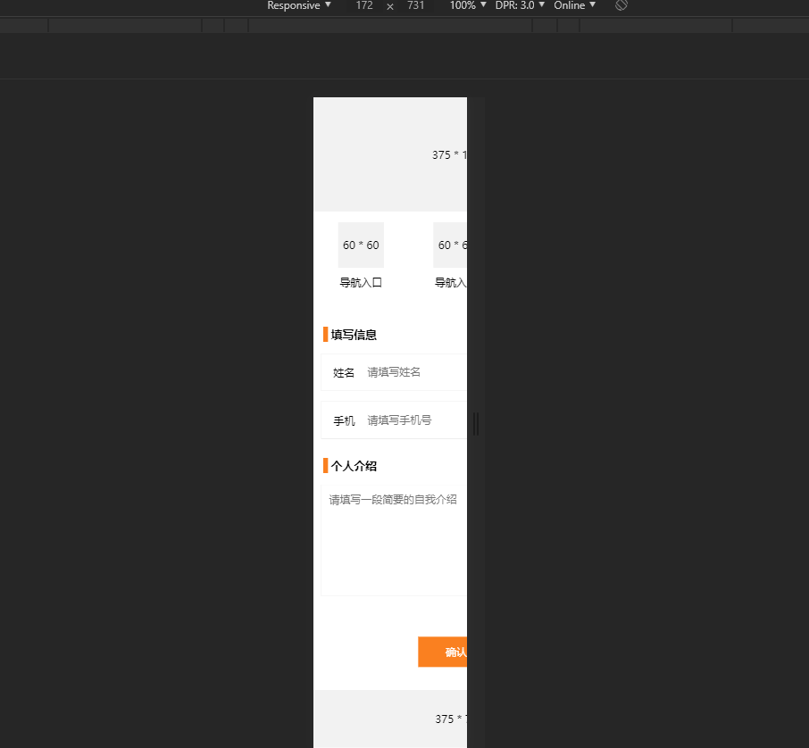
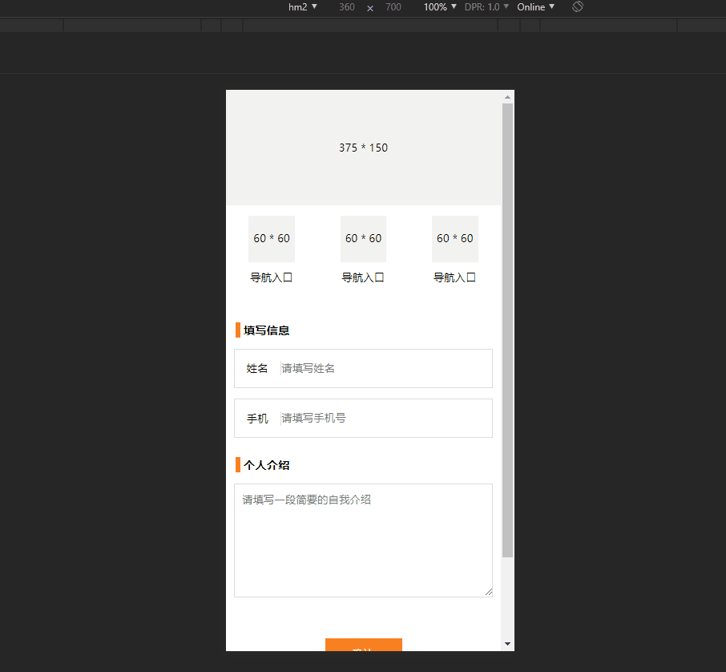
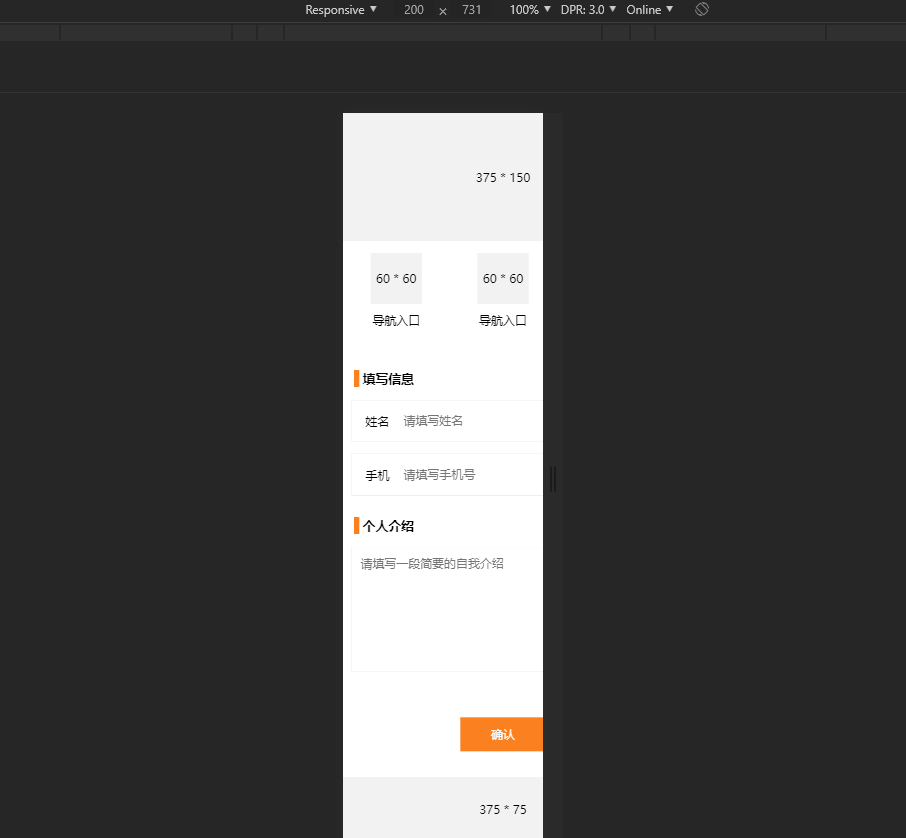
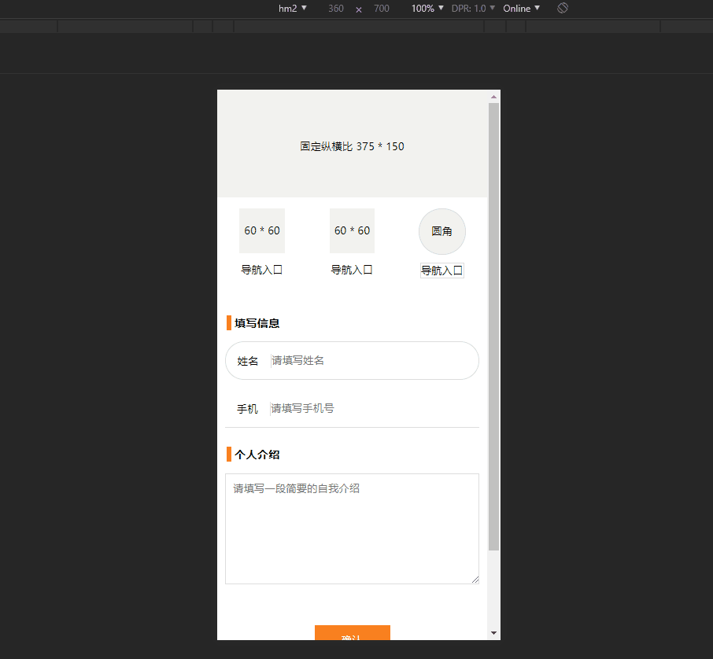
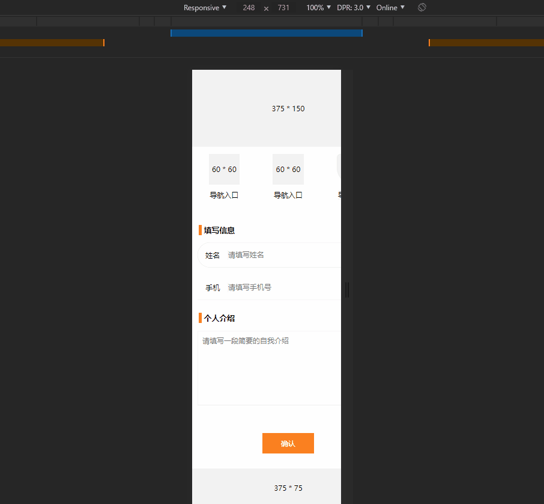
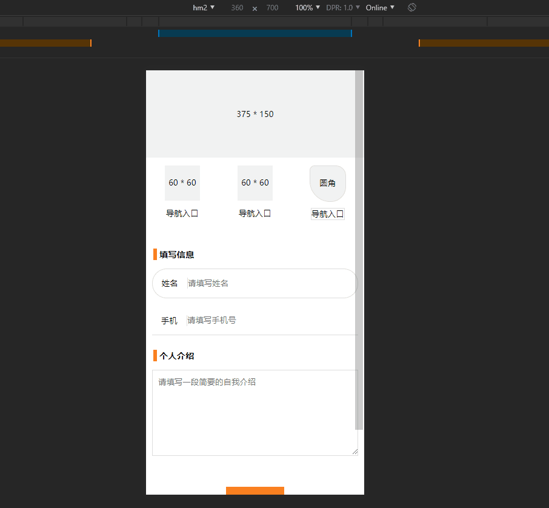

## 移动端布局方案

本项目为移动端 REM布局 与 Viewport (VW) 布局的实例运用

提供三个布局方案

**1. REM 布局** 

[http://localhost:4321/rem/index.html](http://localhost:4321/rem/index.html)

使用js动态设置html的font-size，css使用rem单位，文本大小可选择使用px

js设置viewport的scale以支持高清设备的1px

可设置页面最大最小宽度

**2. VW 布局**

[http://localhost:4321/vw/index.html](http://localhost:4321/vw/index.html)

css使用vw单位，文本大小可选择使用px

使用transform以支持高清设备的边框1px（包括圆角），使用 @mixin `./vw/scss/_border.scss`

可设置容器固定纵横比，不可设置页面最大最小宽度

**3. REM + VW 布局**

[http://localhost:4321/vw-rem/index.html](http://localhost:4321/vw-rem/index.html)

html的font-size使用vw单位，css使用rem单位，文本大小可选择使用px

使用transform以支持高清设备的边框1px（包括圆角），使用 @mixin `./vw-rem/scss/_border.scss`

可设置容器固定纵横比，可设置页面最大最小宽度

## 解析说明 todo

[解析说明](https://www.cnblogs.com/imwtr/p/9576546.html)

## 使用
1. `cd rem-vw-layout` 进入项目
2. `node server` 启动Node服务
3. 访问上述三个页面

4. 业务代码中样式的调用方式可参考 `./rem/scss/rem.scss` 及  `./vw/scss/vw.scss` 及 `./vw-rem/scss/vw-rem.scss` 三个文件

## DEMO 
1. REM 不限制最大宽度

2. REM 限制最大宽度（计算基准与容器）

3. REM 限制最大宽度（仅计算基准），某种流式效果

4. VW 不限制最大宽度

5. REM + VW 不限制最大宽度

6. REM + VW 限制最大宽度（计算基准与容器）

7. REM + VW 限制最大宽度（仅计算基准），某种流式效果

